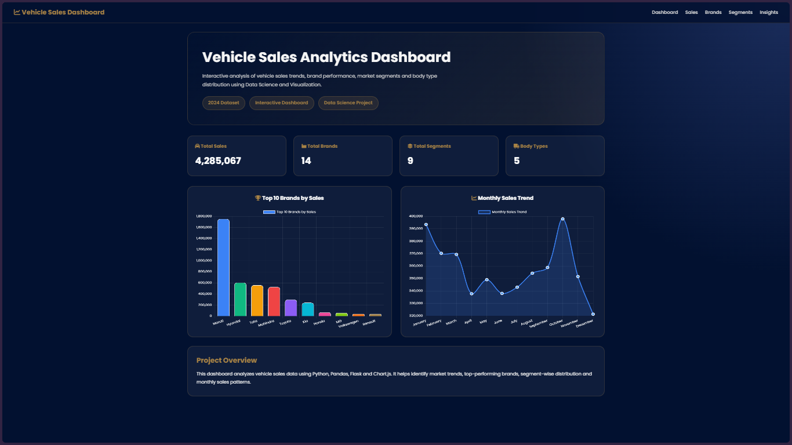
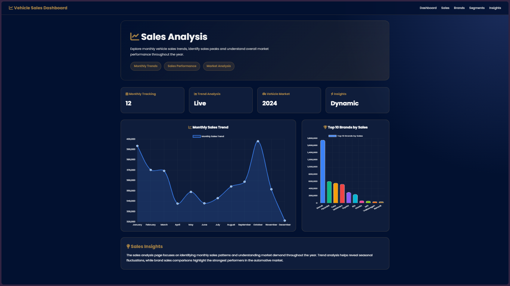
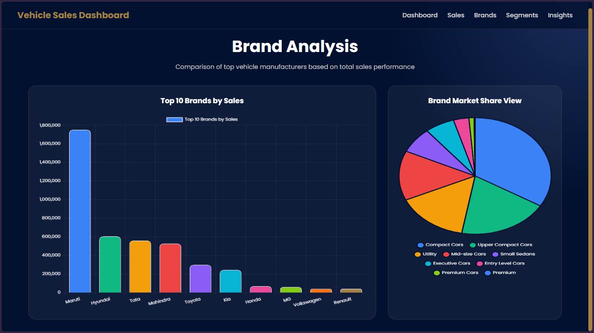
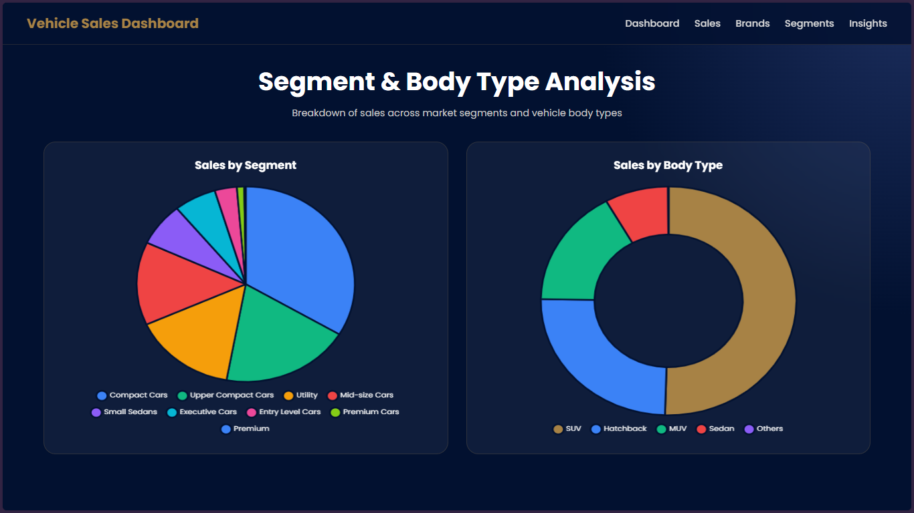
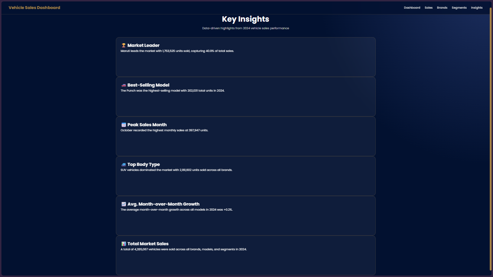

# Vehicle Sales Analytics Dashboard

## Overview

The Vehicle Sales Analytics Dashboard is a web-based analytics application developed using Flask, Python, HTML, CSS, JavaScript, and Chart.js. The dashboard provides interactive visualizations and business insights from a 2024 vehicle sales dataset.

The application enables users to analyze vehicle sales performance, identify top-performing brands, understand market segment distribution, evaluate vehicle category trends, and track sales patterns through an intuitive and responsive interface.

---

## Features

* Interactive analytics dashboard
* Key Performance Indicator (KPI) cards
* Vehicle sales trend analysis
* Brand-wise sales analysis
* Vehicle segment distribution analysis
* Data-driven business insights
* Responsive and modern user interface
* Dynamic data visualization using Chart.js
* Flask-powered backend APIs
* Real-time chart rendering from dataset records

---

## Dataset Information

This project utilizes a Vehicle Sales Dataset (2024) obtained from Kaggle.

The dataset contains vehicle sales information used to generate analytical insights and visualizations throughout the dashboard.

### Dataset Attributes

* Vehicle Brand
* Vehicle Segment
* Vehicle Category
* Sales Volume
* Monthly Sales Records
* Market Distribution Data

### Dataset Source

**Source:** Kaggle (2024 Vehicle Sales Dataset)

The dataset is used solely for educational, analytical, and visualization purposes.

---

## Technologies Used

### Frontend

* HTML5
* CSS3
* JavaScript
* Chart.js

### Backend

* Python
* Flask

### Data Processing

* Pandas
* NumPy

### Development Tools

* Visual Studio Code
* Git
* GitHub

---

## Dashboard Modules

### Dashboard

Displays overall sales statistics, KPIs, and summary analytics.

### Sales

Provides vehicle sales trends and performance analysis through interactive visualizations.

### Brands

Analyzes vehicle sales performance across different manufacturers and brands.

### Segments

Visualizes vehicle sales distribution across various market segments.

### Insights

Presents analytical findings and business intelligence derived from the dataset.

---

## Key Visualizations

### Bar Chart

Displays top vehicle brands by sales.

### Pie Chart

Displays vehicle segment distribution.

### Doughnut Chart

Displays category-wise vehicle distribution.

### Line Chart

Displays vehicle sales trends over time.

---

## Project Structure

```text
vehicle-sales-analytics-dashboard/
│
├── app.py
├── requirements.txt
│
├── static/
│   ├── css/
│   ├── js/
│   └── images/
│
├── templates/
│   ├── dashboard.html
│   ├── sales.html
│   ├── brands.html
│   ├── segments.html
│   └── insights.html
│
├── dataset/
│
└── README.md
```

---

## Installation

### Clone the Repository

```bash
git clone https://github.com/your-username/vehicle-sales-analytics-dashboard.git
```

### Navigate to Project Directory

```bash
cd vehicle-sales-analytics-dashboard
```

### Install Dependencies

```bash
pip install -r requirements.txt
```

### Run the Application

```bash
python app.py
```

### Open in Browser

```text
http://127.0.0.1:5000
```

---

## Future Enhancements

* Advanced filtering and search options
* Export reports to Excel and PDF
* Predictive sales analytics
* Machine Learning-based forecasting
* Interactive drill-down visualizations
* Real-time dataset integration

---

## Learning Outcomes

This project demonstrates practical implementation of:

* Data Visualization
* Business Intelligence Dashboards
* Flask Web Development
* REST API Integration
* Frontend-Backend Communication
* Data Analytics using Python
* Interactive Chart Design

---

## Screenshots

### Dashboard Overview

Displays key performance indicators, overall sales metrics, and summary analytics.



### Sales Dashboard

Provides sales-related visualizations and trend analysis.



### Brand Analysis

Displays sales performance across different vehicle brands.



### Segment Analysis

Visualizes vehicle sales distribution across market segments.



### Insights Dashboard

Provides analytical insights and business intelligence derived from the dataset.



---

## License

This project is licensed under the MIT License.

---

## Author

Developed by Raaghav Ramesh as a data science and visualization project using Flask and Chart.js.
